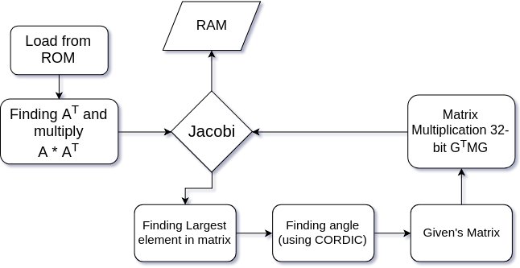

# Eigen-Value algorithm
This Repository consists of implementation of Principal Component Analysis(PCA) of an `N X N` image input which is find using the Jacobi Eigenvalue Algorithm in matlab and verilog. Using the co-variance matrix `C = A*(A)^T` of an image A and applying similiar transformation on `C` and then finding eigenvectors based on that. Mean Square error is also plotted against inbuilt function.

For the FPGA implementation, CORDIC algorithm was used for finding the angles for jacobi method. An input file of `32 X 32` in binary was 
taken.All the modules are implemented using the pipelining technique for faster execution.

  ##FPGA MODULES FLOW
